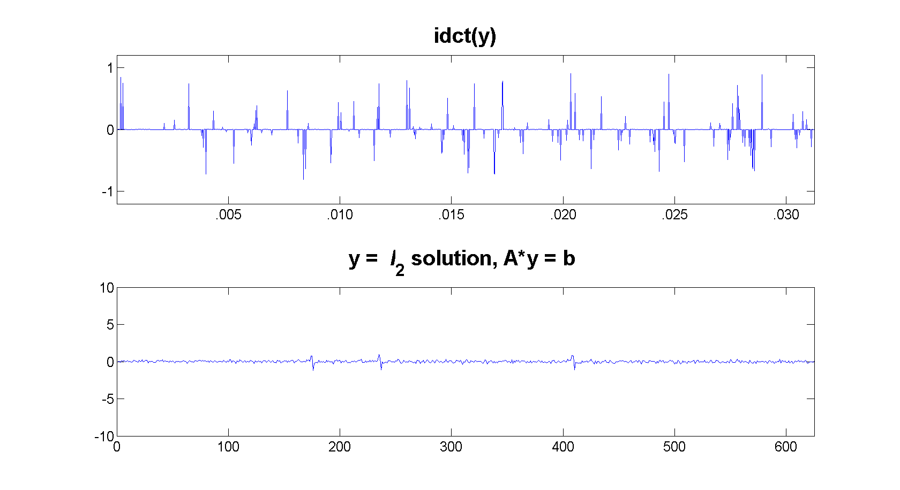

# SparseSignal-AlmostExactRecon
Almost Exact Reconstruction of Sparse Signals from Pseudo-Random Samples

A simple yet concrete example of Compressed Sensing - The l1 solution yields an almost exact reconstruction of the original signal. `l1-MAGIC`, written by Justin Romberg and Emmanuel Candes, is used to solve the optimization problem (nonlinear regularization involving l1 norm) at hand.

The code `Detect_WordBoundary.m` generates the following relevant plots.
### The Original Signal and its Discrete Cosine Transform

### The **l1** solution, **x**, and its Inverse Discrete Cosine Transform

### The **l2** solution, **y**, and its Inverse Discrete Cosine Transform

### The Reconstructed Signal and the Original Signal

Please refer to the **ResultsReport.pdf** for details on the implementation.
### Future Work:
* Assess reconstruction quality with compressed sensing on a speech utterance.
