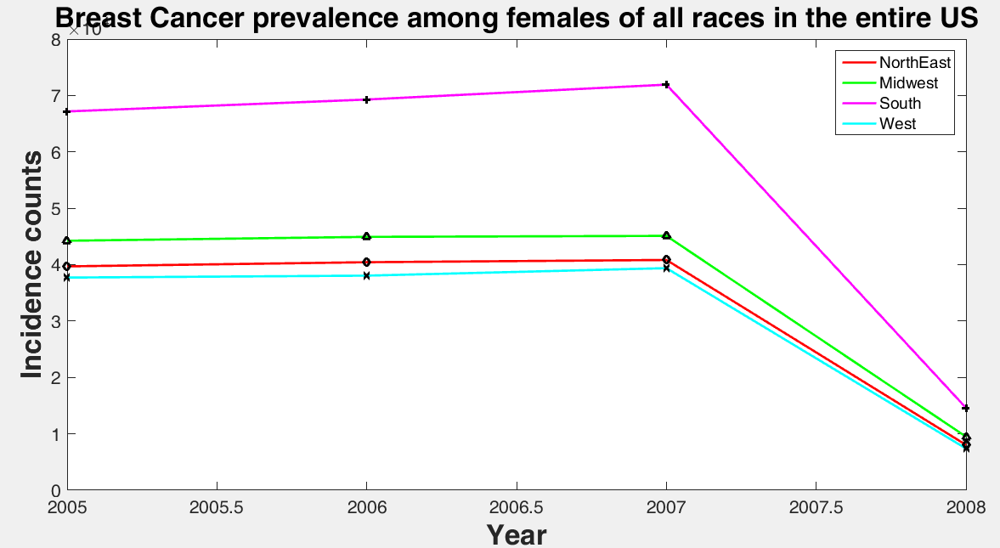

U.S. Cancer Statistics Working Group. United States Cancer Statistics: 1999–2012 Incidence and Mortality Web-based Report. Atlanta: U.S. Department of Health and Human Services, Centers for Disease Control and Prevention and National Cancer Institute; 2015. Available at: www.cdc.gov/uscs.

**Data saved in .csv format and then imported, edited in Excel, plotted in MATLAB**

